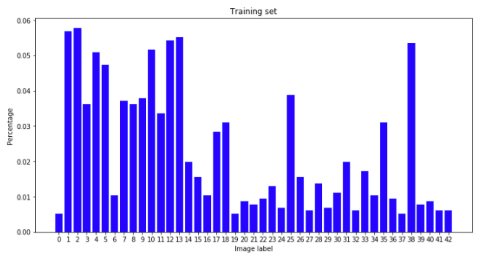
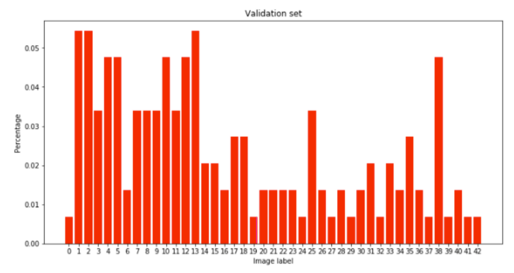
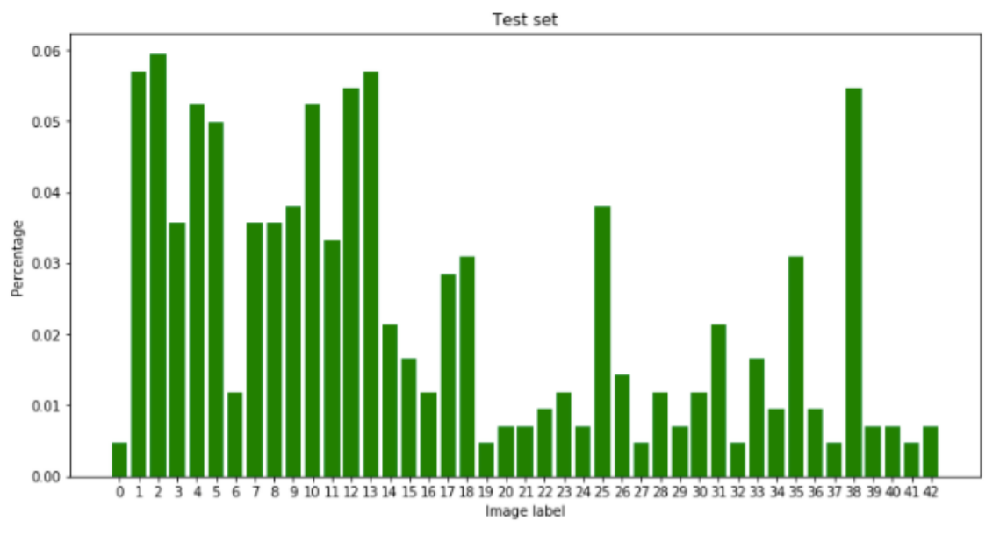
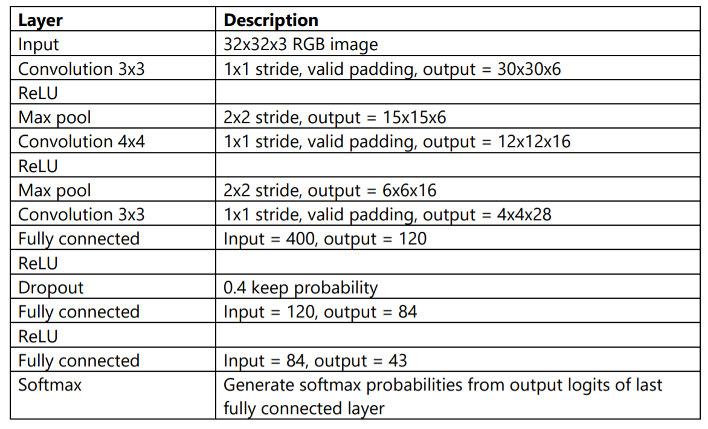
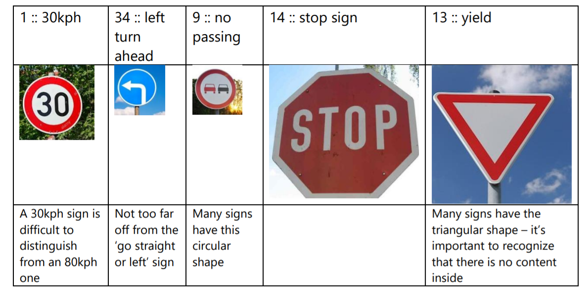

## Traffic Sign Recognition Program

Overview
---
In this project, a CNN is used to classify traffic sign images from the [German Traffic Sign Dataset](http://benchmark.ini.rub.de/?section=gtsrb&subsection=dataset). 

### Data Set Summary & Exploration
1. For the traffic sign dataset, I used Python to create a basic summary of the data in the
set. After loading each set into a list, I found the number of examples in each set to be:  
 * 34799 training examples
 * 4410 validation examples
 * 12630 training examples  
 
The shape of each example image is 32x32 pixels, and since it is an RGB image the size
is actually 32x32x3.
The number of unique classes was discovered to be 43. This was done by finding the
number of unique elements in the training labels list.

2. The dataset was explored to see the distribution of repeat examples in each set. The
number of repeat examples was placed on a bar graph, and it can be visibly confirmed
that each set is similar in its image class distribution. It also becomes clear that the
examples are not evenly distributed among the classes, with some classes being
represented 5 times more than the least represented one.  

### Design and Test a Model Architecture
1. The data was pre-processed by simply normalizing the RGB values of each image so
that the values had zero mean and zero variance. The values are normalized so that the
optimizer can more easily arrive at the correct weights.  

2. My model consists of convolutions, max pooling, fully connected layers, dropout
layers, and ReLUs in the following order: 

3. The model was trained using the layers above with TensorFlow’s AdamOptimizer with
a learning rate of 0.0008. The data was fed into the model over 20 epochs with a batch
size of 128.  

The derivation of the model was an iterative process. I started with the LeNet model
since it is already set up to be trained on 32x32x3 images, but the accuracy was too low
using just the two convolutional layers so a third one was added.
Next, the model was overfitting to the training data very quickly (reaching +90%
accuracy after 2 epochs), so a dropout layer with keep_probability = 0.5 was added
between the first and second fully connected layers.  

The validation accuracy increased with this added dropout layer, but the model was still
overfitting to the training data was hitting close to 98% accuracy on the training set
after around 14 epochs while the validation accuracy was at around 93%. The validation
accuracy would also fluctuate above and below 93%.  

Finally, to reduce overfit and reduce fluctuating accuracy, I added another dropout layer
between the second and third fully connected layers, adjusted their keep probabilities,
and lowered the learning rate from 0.0008 to 0.0006.
After the adjustments, the increase in validation accuracy was steady and stable with
each epoch and it eclipsed 93% accuracy.  

My final accuracy results are as follows:  
Validation accuracy = 94.1%  
Test accuracy = 92.5%  

### Test a Model on New Images
1. The five German traffic sign images I used are:  

The results were very successful in classifying the new images with an accuracy of 100%.
This is obviously higher than the test set accuracy, but for such a small data set this is
always a possibility. 

Interestingly enough, the model was very confident about all predictions except for the
stop sign image. For the 30kph, the left turn head, and the yield sign images, the
confidence was 100% when rounded to the nearest 3rd decimal place. The confidence
for the ‘no passing’ sign was also very high, with a 95% confidence for the correct
prediction. However, the confidence for the correct prediction for the stop sign is only
73%.

